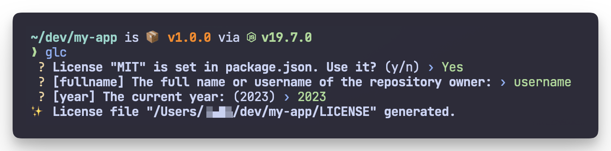

# genelic 

> ⚖️ Generate a license file for your project easily



`genelic` is a command line tool to generate a license file for your project easily.

You can choose from all the licenses in [choosealicense.com](https://choosealicense.com/appendix/).

## Install

### Deno (Recommended)

```
deno install -qAn glc https://raw.githubusercontent.com/fus1ondev/genelic/main/mod.ts
```

You can upgrade genelic with the following command.

```
genelic upgrade
```

### Homebrew

```
brew install fus1ondev/tap/genelic
```

### ~~npm~~ (Deprecated)

> **Warning**
> Currently v1 cannot be exported to npm, so the version of what can be installed from npm is out of date.

```
npm install -g genelic
```

## Features

### Automatic selection of the licence in use

If a license field is found in the following files, the license will be automatically selected.

- `package.json`
- `Cargo.toml`
- `pyproject.toml`

### Autocompletion of fields

Most licences have fields that require detailed information to be entered.

It asks for these values when the file is generated, but the following sources are used to automatically fill in the fields.

- local or global git config
- `package.json`
- `Cargo.toml`
- `pyproject.toml`

## Basic Usage

To create a file "LICENSE" for the MIT license in the current directory, do like this:

```
$ glc mit
```

### Options

```
$ glc -h

  Usage:   glc [id]
  Version: 1.3.0

  Description:

    Generate a license file for your project.

  Options:

    -h, --help               - Show this help.
    -V, --version            - Show the version number for this program.
    -t, --title    <title>   - Use title instead of id.
    -o, --output   <output>  - Output file name.                          (Default: "LICENSE")
    -f, --force              - Overwrite existing license file.
    -p, --parents            - Create parent directories as needed.

  Commands:

    info     [id]  - Show license info.
    preview  [id]  - Preview license.
    list           - List all licenses.
    upgrade        - Upgrade genelic. (Don't use this if you installed genelic from Homebrew.)
```

The full list of license identifiers can be found on the [`github/choosealicense.com`](https://github.com/github/choosealicense.com/tree/gh-pages/_licenses) repository.

## Advanced Usage

### Use with fzf

By using the [fzf](https://github.com/junegunn/fzf) command, you can select a license with a graphical fuzzy finder.

The width of the `info` and `preview` commands is automatically adjusted to the width of the fzf preview window.

#### Example

```
glc list -i | fzf --preview "glc info {} ; glc preview {}" --bind "enter:become(glc {})"
```

If you want to use license names instead of IDs as titles of the list:

```
glc list -t | fzf --preview "glc info -t {} ; glc preview -t {}" --bind "enter:become(glc -t {})"
```

## Development

To update the license data (`licenses.ts`), you need to update the submodule recursively.

```
git clone --recursive https://github.com/fus1ondev/genelic

cd genelic

deno task run [...]
```

### Update license data

```
deno task generate-data
```

## License

MIT